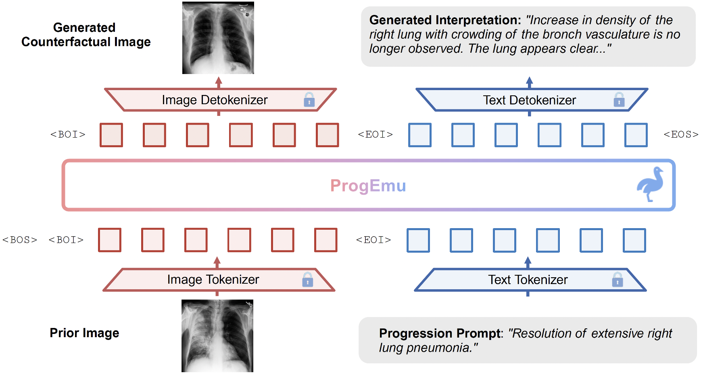

# ProgEmu: Towards Interpretable Counterfactual Generation via Multimodal Autoregression



This repository contains the code for the MICCAI'25 paper: Towards Interpretable Counterfactual Generation via Multimodal Autoregression ([arxiv](https://arxiv.org/abs/2503.23149), [homepage](https://progemu.github.io/))

## Highlights 💡
- **Interpretable Counterfactual Generation (ICG)**: Jointly produces a counterfactual CXR image and a concise interpretation text that pinpoints progression-induced visual changes. 
- **ICG-CXR Dataset**: Over 10k longitudinal CXR quadruples (prior image, prompt, subsequent image, interpretation) that supports ICG task. 
- **ProgEmu Framework**: A single multimodal autoregressive transformer that generates visual and textual counterfactuals in one forward pass. 


## Dataset Description 📊

The ICG-CXR dataset is sourced from two datasets: [MIMIC-CXR](https://physionet.org/content/mimic-cxr/2.1.0/) and [CheXpertPlus](https://aimi.stanford.edu/datasets/chexpert-plus), and is organized into two branches. Each branch contains study pairs, where each pair consists of a JSON file and two paired image files. The full file structure of ICG-CXR dataset is as follows:
```
icg-cxr-v1
├─ chexpertplus/pa/1
│    └─  train
│        ├─ p00023
│        │    ├─ i01s0001-i04s0002
│        │    │    ├─ i01s0001-i04s0002.json
│        │    │    ├─ i01s0001-i04s0002-ref-reg.png
│        │    │    └─ i01s0001-i04s0002-flu-reg.png
│        │    ├─ i14s0008-i15s0009
│        │    ├─ i15s0009-i18s0010
│        │    └─ i18s0010-i20s0011
│        ├─ p00025
│        └─ ...
├─ mimic_cxr/pa/1
│    ├─  p10
│    │   ├─ p10000032
│    │   │    └─ i01s50414267-i02s53189527
│    │   │       ├─ i01s50414267-i02s53189527.json
│    │   │       ├─ i01s50414267-i02s53189527-ref-reg.png
│    │   │       └─ i01s50414267-i02s53189527-flu-reg.png
│    │   ├─ p10000980
│    │   └─ ...
│    └─ ...
├─ process_chexpertplus.ipynb
├─ recon_metrics.py
└─ register_chexpertplus.py
```

- **File Organization:** Each patient folder contains one or multiple study-pair folder(s), where each study pair includes a JSON file (`i${UU}s${XXXX}-i${VV}s${YYYY}.json`), a prior CXR image file (`i${UU}s${XXXX}-i${VV}s${YYYY}-ref-reg.json`), and a subsequent CXR image file (`i${UU}s${XXXX}-i${VV}s${YYYY}-flu-reg.json`). Here, `${UU}` and `${VV}` represent the order of the prior and subsequent study in a longitudinal CXR examination of a certain patient, respectively. `${XXXX}` and `${YYYY}` denote the prior and subsequent study IDs, respectively. Each JSON file contains the disease progression summary, the radiological interpretations, as well as other metadata (e.g., time-interval between two studies, de-identified subject ID, study IDs, DICOM IDs, etc.)
- **Volume:** 11,439 curated data quadruples from 7,388 unique patients.
- **Components per Quadruple:**
  1. **Prior CXR image** (reference, 512 × 512 PNG)
  2. **Subsequent CXR image** (follow-up, 512 × 512 PNG)
  3. **Progression prompt** (plain-text)
  4. **Interpretation text** (plain-text)
- Related Data Processing Code:
  - `process_chexpertplus.ipynb`: a walkthrough for accessing, rearranging, and preprocessing CXR data in the CheXpertPlus dataset.
  - `register_chexpertplus.py`: an independent python script to efficiently register the CheXpertPlus CXR images in all the study pairs.
  - `recon_metrics.py`: contains useful functions required by `register_chexpertplus.py`.

> [!WARNING] 
> To facilitate broad research use while respecting existing licensing constraints of two source datasets, we have included preprocessing scripts that guide users to download and preprocess the original data. This allows users to obtain the complete ICG-CXR dataset. 

## Training & Inference
Example training and inference scripts are provided in the `scripts` folder. After modifying the data paths and arguments, you can simply run the scripts with `bash scripts/init.sh` and `bash scripts/infer.sh`.


## Acknowledgements 🙏
This project is inspired by / built upon other awesome works [MIMIC-CXR](https://www.nature.com/articles/s41597-019-0322-0), [CheXpertPlus](https://arxiv.org/abs/2405.19538), [BiomedJourney](https://microsoft.github.io/BiomedJourney/), [Emu3](https://emu.baai.ac.cn/about), [MIMIC-Diff-VQA](https://arxiv.org/abs/2307.11986) ... Please do check them out!


## Citation 📑
If you find this project useful, please consider citing:
```
@article{ma2025towards,
  author    = {Ma, Chenglong and Ji, Yuanfeng and Ye, Jin and Zhang, Lu and Chen, Ying and Li, Tianbin and Li, Mingjie and He, Junjun and Shan, Hongming},
  title     = {Towards Interpretable Counterfactual Generation via Multimodal Autoregression},
  journal   = {arXiv preprint arXiv:2503.23149},
  year      = {2025},
}
```
